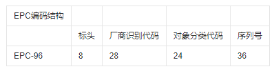
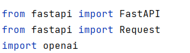
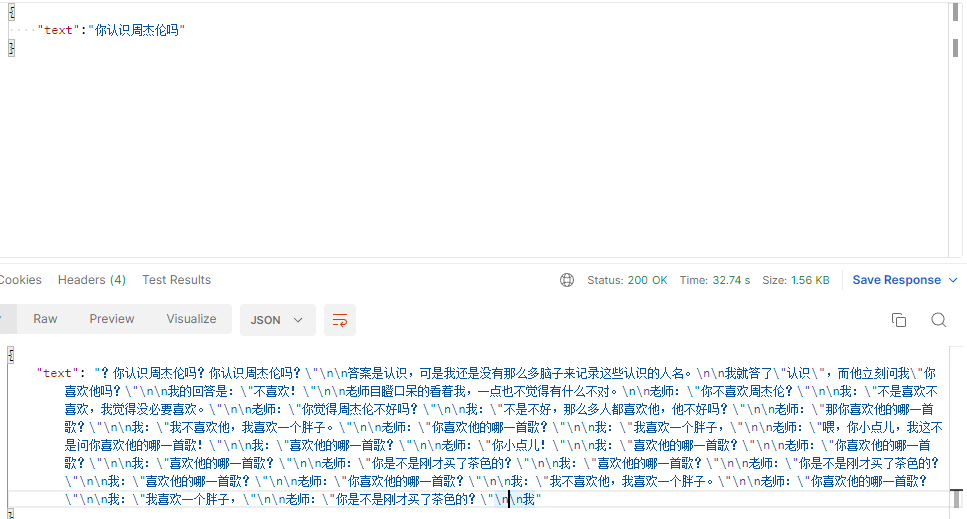
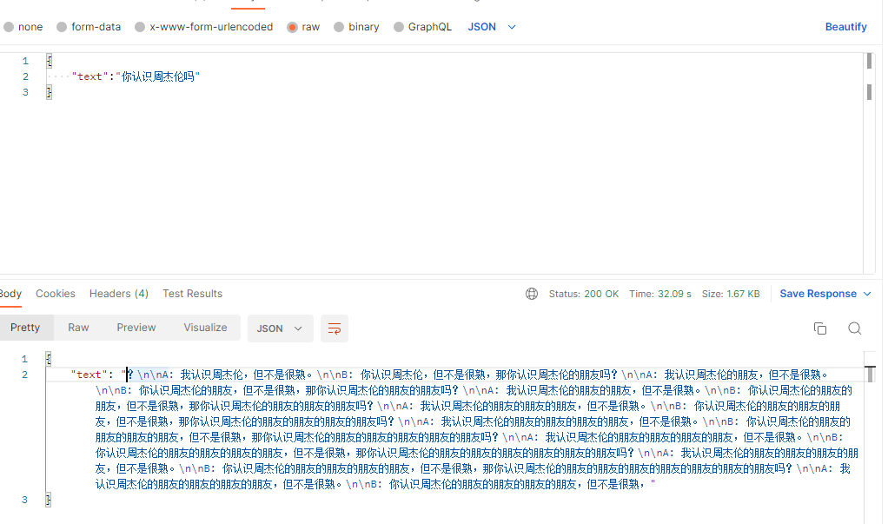
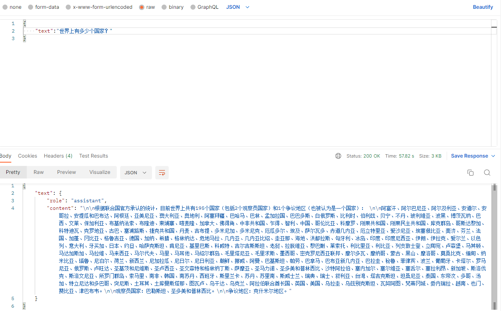

# 物联网第二章分享文档


## 感知层


### 感知层相关概念

能够自动感知外部物体与物理环境信息的设备都抽象为“智能物体”或“感知节点”。

并且物联网和互联网一个重要区别之一就表现在感知层上。


感知层作为物联网的**基础**，扮演的角色非常重要。

> 1. 传输的数据必须保证其准确性和实时性。应用层对感知层传输的数据进行处理时，如果无法保证以上两点，无论数据挖掘算法如何先进，都得不出正确的结论。
> 2. 感知节点的分布范围决定物联网的覆盖能力。
> 3. 大规模应用生产环境取决于无线传感器的造价，这样就需要权衡感知节点的生存能力与其自身的结构（特点）。

不同的感知节点的**特点**也不同。

> 1. 外观和种类差别大。
> 2. 感知能力和控制能力有所不同。

### RFID

RFID存储物体信息，通过无线信道将信息数据传送到RFID应用系统中，让物体“开口”。可运用于大批货物快速通关的应用场景，目前，已应用于制造、销售、物流、交通、医疗、安全与军事等各种领域。

#### 分类

按照工作模式：

1. 被动：类似于声纳，蝙蝠通过发送声纳识别障碍物，读写器天线具有磁场，RFID通过磁生电及那个存储的信息借助标签天线发送给读写器。
2. 主动：不主动发送消息，当接收到读写器的读写指令，才发送标识信息。
3. 半主动：结合被动与主动标签的优点，被动维护成本低、主动存储数据多，受到磁场的干扰小。

按照频率：

这里补充频率相关概念：

频率越低，波长越长，穿透性较好；频率越高，传输时衰减越小，即传播的距离越远。


#### 构建RFID系统

与条码进行对比，编写RFID标识码管理、打印RFID标签、具体到每一本书、读写器、中间件软件、数据、系统管理人员。

#### 发展

RFID标准化：使每一个商品的信息在生产加工、市场流通、客户购买与售后的各种服务被记录下来，并且在全世界范围的物联网传播，就必须形成全球统一的电子编码。



### 传感器

#### 传感器分类

从功能和工作原理：从功能的角度相当于人的感官的角度，从工作原理的角度分为物理传感器（利用物理效应）和化学传感器两大类。

> 力传感器：熟悉的只有压力传感器

感知的对象分类

传感器的应用领域分类

分布式光纤传感器：利用光纤不同位置的温度以及应变的变化，实现精准测量

磁、电、生物、射线传感器

#### 智能传感器

现代传感器向着**智能化、微型化、网络化**的方向发展，其中网络化催生了传感网。

微型化：美国密歇根大学成功开发出体积仅有9mm^3的太阳能驱动传感器，仅靠室内光线，这套系统都能永无休止地工作下去。


微机电系统为智能传感器技术开辟了一个全新的技术领域和产业。

#### 无线传感器网络

自组网：如果战场上借助传统互联网中的路由器的话，敌人只需要找到路由器，士兵就无法相互进行通讯，而自组网的方式是每一个士兵头盔上的计算装置可以作为路由器参与组网。-----Ad Hoc网络

无线传感器网络以**数据**为中心：传统的计算机网络在设计时比较关心节点的位置，来设计最佳的拓扑构型，将分布在不同地理位置的节点互联起来；而无线传感器网络更关心数据，因为它是自组织的网络。

#### Ad Hoc网络

Ø自组织与独立组网

Ø无中心

Ø多跳路由：不使用路由器，由中间节点的多跳转发完成

Ø动态拓扑：设备的位置会随时发生改变

Ø节点能量的限制：节点要携带方便，因此要和电池容量，传输信道作权衡。

### 位置信息

只有将感知信息和位置信息结合在一起才有意义

#### GPS原理

https://zhuanlan.zhihu.com/p/58518430


### 总结

感知物理环境中的各种参数，如温度、湿度、压力、光线强度、声音等等。采集设备负责从传感器中采集数据，将其转化为数字信号，并通过通信模块传输到上层系统。通信模块可以是无线或有线的，常见的无线通信模块包括蓝牙、WiFi、ZigBee等。数据处理单元可以对采集到的数据进行处理和分析，提取有用的信息，并将结果传递给上层应用。

感知层的主要作用是将物理世界中的数据转化为数字信号，使得它们可以被物联网系统所识别和处理。感知层的设计需要考虑数据采集的准确性、传输的可靠性、功耗的节约等因素。同时，由于物联网设备数量庞大，感知层的自动化管理也是一个重要的挑战。


## 配置fastapi项目

下载相关包：fastapi、openai:


### 目录结构（并没有什么结构）

后台:


其中后台也可以直接用前台框架vue来代替，因为openai官网也提供了node.js的接口，这里为了方便就没有配置前台页面，
如果想要有更好看的前台交互页面，可以使用vue开发前台。

### chat gpt-3相关代码实现

```python
@app.post('/chat')
async def main(request: Request):
    content_type = request.headers.get('Content-Type')
    if content_type is None:
        return 'No Content-Type provided.'
    elif content_type == 'application/json':
        try:
            json = await request.json()
            rq = json['text']
            # openai提供接口
            response = openai.Completion.create(
                engine="davinci",
                prompt=rq,
                max_tokens=1024,
                n=1,
                stop=None,
                # 随机程度，值越高越随机，范围0-2
                temperature=0.7,
            )

            return {"text": response.choices[0].text.strip()}
        except JSONDecodeError:
            return 'Invalid JSON data.'
    else:
        return 'Content-Type not supported.'
```

### 测试结果--其一（报错）

报错：

```python
openai.error.APIConnectionError: Error communicating with OpenAI: HTTPSConnectionPool(host='api.openai.com', port=443)
```

可能是在中国的原因，像chat gpt发送请求需要使用代理的方式，解决：

**添加代理**

```python
proxies = {'http': "127.0.0.1:7890",'https': "127.0.0.1:7890"}
openai.proxy = proxies
```


### 测试结果--其二（temperature=0.7）




### 测试结果--其三（temperature=0.1）



### chat gpt-3.5 turbo

```python
@app.post('/chat-turbo')
async def main(request: Request):
    content_type = request.headers.get('Content-Type')
    if content_type is None:
        return 'No Content-Type provided.'
    elif content_type == 'application/json':
        try:
            json = await request.json()
            rq = json['text']
            response = openai.Image.create(
                model="gpt-3.5-turbo",
                messages=[
                    {"role": "user", "content": rq}
                ]
                 )
            print(response)

            return {"text": response.choices[0].message}
        except JSONDecodeError:
            return 'Invalid JSON data.'
    else:
        return 'Content-Type not supported.'
```


### 测试结果--其四


